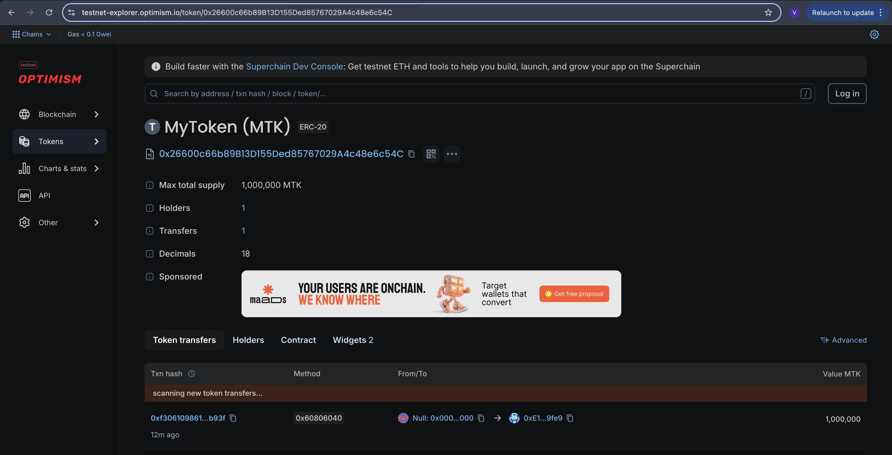

# MyToken (ERC20 Project)

## Project Description
This project implements an ERC20 token using OpenZeppelin contracts and Hardhat.  
It includes minting functionality restricted to the owner, token transfers, and test cases.

---

## Features
- ERC20 token (MyToken - MTK)
- Owner-restricted mint function
- Transfer functionality
- Unit tests for minting, transferring, and edge cases

---

## Deployment

The contract is deployed on OP Sepolia testnet:

**Contract Address:**
0x26600c66b89B13D155Ded85767029A4c48e6c54C

**Block Explorer Link:**
https://testnet-explorer.optimism.io/token/0x26600c66b89B13D155Ded85767029A4c48e6c54C

---

## Screenshot

---

## Tech Stack
- Solidity
- Hardhat
- OpenZeppelin
- Ethers.js
- Mocha + Chai

---

## Author
Volha Platnitskaya Pr2